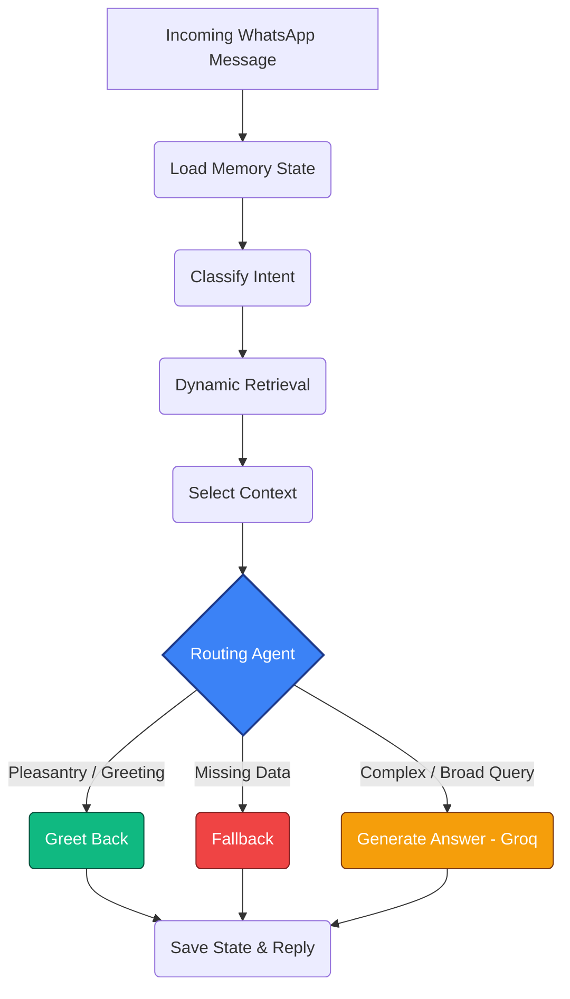
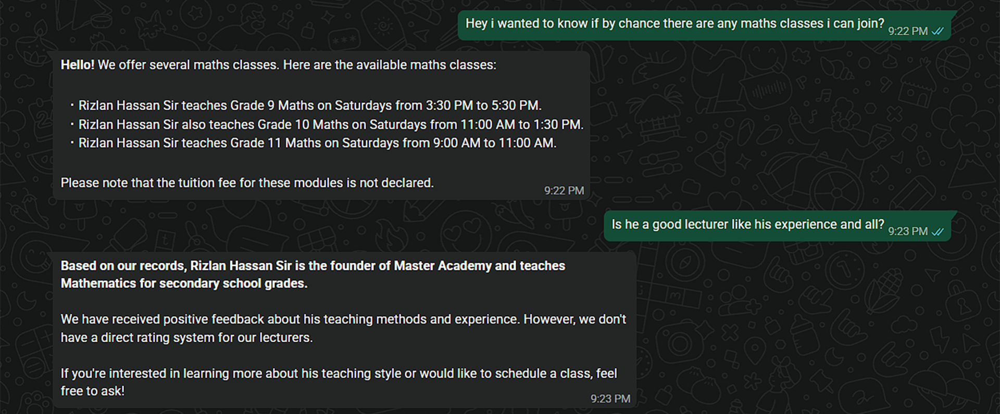
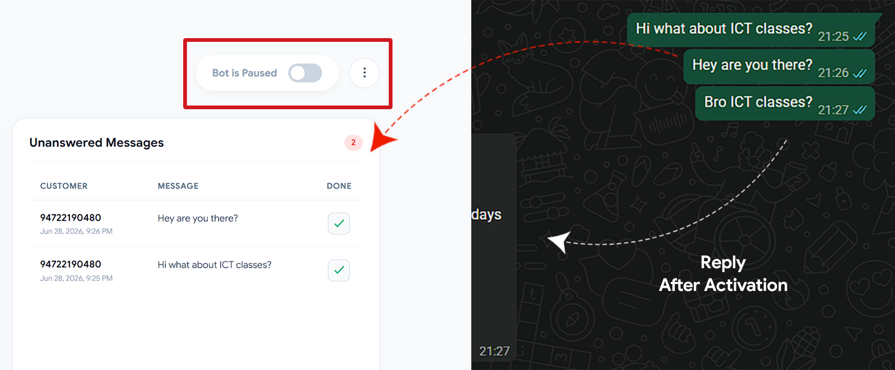

<h1>
  
  WhatsAgent
</h1>

**Transform your business WhatsApp into an intelligent, automated support engine powered by live Google Docs**
 
 

🔗 [https://whats-agent-phi.vercel.app](https://whats-agent-phi.vercel.app)

---

## 🛑 The Problem

Businesses lose customers every day due to delayed responses. Traditional chatbot systems attempt to solve this, but they rely on rigid, frustrating decision trees.

Standard Retrieval-Augmented Generation (RAG) systems are an improvement, but they lack reasoning. A standard RAG simply searches a vector database, dumps the nearest chunks into a prompt, and relies on the LLM to figure it out. This leads to high latency, expensive token costs, hallucinated responses when data is missing, and an inability to handle conversational nuances like follow-up questions or pleasantries.

## 🚀 Introducing WhatsAgent

WhatsAgent is not just another wrapper around an LLM. It is an **Agentic RAG** system built specifically for WhatsApp business support. By utilizing LangGraph, the system acts as a stateful, reasoning agent that dynamically routes queries, manages conversation memory, and optimizes retrieval strategies based on the *intent* of the user, ensuring instant, accurate, and context-aware replies.

---

### Main Components

| Component | Purpose |
| --- | --- |
| **React + Vite** | Frontend UI and user dashboard |
| **FastAPI** | Backend API, graph orchestration, and webhook handling |
| **LangGraph** | Agentic workflow, state management, and query routing |
| **Supabase (PostgreSQL)** | Vector storage (pgvector), auth, and conversation memory |
| **Groq (LLaMA 3.1 8B)** | Lightning-fast answer generation and intent classification |
| **Google Gemini (gemini-embedding-001)** | Dense vector embeddings for document chunks |
| **Evolution API** | WhatsApp Web instance management and messaging engine |
| **Google Drive API** | Live document fetching and synchronization |

---

## 🧠 Agentic Architecture

What makes this system "Agentic" rather than "Standard" is its state-driven graph architecture. Every message passes through a series of intelligent nodes:

1. **Memory Node (`load_memory`):** Injects the last 5 messages and recent topic context into the current state.
2. **Intent Classification Node (`classify_intent`):** Analyzes the query to determine if it is a `broad` question, a `followup`, or a specific query (e.g., `location`, `pricing`).
3. **Dynamic Retrieval Node (`retrieve`):** Adjusts the top-K chunks dynamically. For a `broad` query, it fetches up to 10 chunks to summarize a list. For a highly specific narrow question, it fetches 4.
4. **Context Selection Node (`select_context`):** Analyzes similarity thresholds and keyword scores to discard irrelevant chunks before they ever reach the LLM.
5. **The Routing Agent**

* **Fallback Node (Pleasantry / Out of Scope):** This node acts as an intelligent traffic filter to keep the conversational experience feeling natural while strictly protecting the boundaries of your business knowledge. It handles two distinct scenarios:
    
    * *Greetings & Simple Pleasantries:* If the user sends a simple greeting or acknowledgment (e.g., *"Hi"* or *"Thank you"*), the system recognizes this instantly. Instead of coldly rejecting the message with a missing-data notice, it replies with a human-like greeting.
    
    * *Out-of-Scope Questions:* If a user asks a general knowledge trivia question, requests an out-of-bounds topic (e.g., *"How do rockets work?"*), or makes an entirely unrelated statement, the agent cleanly traps the request. It completely bypasses the LLM generator to avoid hallucinations and outputs a polite refusal message and the query is then cleanly marked as unanswered on your dashboard.

* **Generation Node (Valid Business Query):** For any legitimate inbound query regarding your explicit business operations (such as class schedules, price structures, branches, or course options), the agent skips the fallback mechanics entirely. It forwards the dense, curated context chunks straight to the Groq LLaMA 3.1 8B engine to generate a highly personalized, context-aware, and natural response in real-time.

## ⚡ Engineering Highlights

### Dual LLM Engine

To balance cost, rate limits, and latency, the system splits responsibilities across two distinct AI providers:

* **Google Gemini (gemini-embedding-001):** Utilized exclusively for generating 768-dimensional dense vector embeddings during document ingestion and search.
* **Groq (LLaMA 3.1 8B):** Handing answer generation. Because Groq runs on specialized LPU hardware, responses are generated in milliseconds, allowing the bot to reply to customers in real-time.

### Google Docs over Static PDFs

Instead of requiring businesses to upload static PDFs, WhatsAgent ingests a live Google Document. Businesses constantly update prices, policies, and offers. By using a public Google Doc URL, owners can seamlessly edit their knowledge base natively in Google Docs, click "Update" on the WhatsAgent dashboard, and instantly sync the new structured vectors into the database.

### Contextual Memory & Follow-ups

Standard RAGs fail when a user asks, "Is he a good lecturer" because the query lacks keywords. WhatsAgent saves the conversation state.

* *Example Flow:* 

  
  
* *Agentic Action:* The `load_memory` node injects the "Maths Class/Rizlan Hassan" context, allowing the retriever to search for "Experience and Rating of Rizlan" without the user explicitly stating who is "he".

---

## 🛠 Core Features

### 1. Linking WhatsApp via Evolution API

Connecting a bot to WhatsApp usually requires Meta's Cloud API, which restricts access to verified business portfolios. Because this is an MVP, WhatsAgent integrates the **Evolution API (Baileys)**. Users simply scan a QR code from the dashboard to link their standard WhatsApp number as an official "Linked Device."
*(Note: For enterprise deployment, this module can be swapped to Meta's embedded signup co-existence flow).*

  

### 2. Unanswered Query Tracking
AI shouldn't trap customers. If a customer asks a question that isn't covered in your Google Doc, the bot won't hallucinate an answer; it politely defers and marks the chat as "unanswered." Similarly, if an owner spots a high-value customer or a sensitive issue, they can use the "Pause Bot" toggle to temporarily halt the AI and take over manually.

  

### 3. Instant Knowledge Updates
WhatsAgent adapts to your business in real-time. If you check your dashboard and notice the bot missing specific questions you can fix the blind spot instantly. Simply type the missing details into your connected Google Doc and click the update button on your dashboard. The system will dynamically re-embed the new vectors.

  

---

ⓘ Note

* **Repository Scope:** This public repository contains only the frontend codebase for demonstration purposes. To protect proprietary AI routing logic and ensure system security, the core Agentic RAG backend architecture is maintained in a separate private repository.
  
* **Live Demo Cold Starts:** The backend and Evolution API services are hosted on Render's free tier, which automatically spins down after periods of inactivity. If you are testing the live demo, please allow **2-3 minutes** for the initial QR code to generate and for the bot to reply to your very first message while the servers "wake up." All subsequent replies will be instant.

---

  <h2>Contact Me</h2>
  
Have inquiries or feedback? Feel free to reach out!

  
  

---
